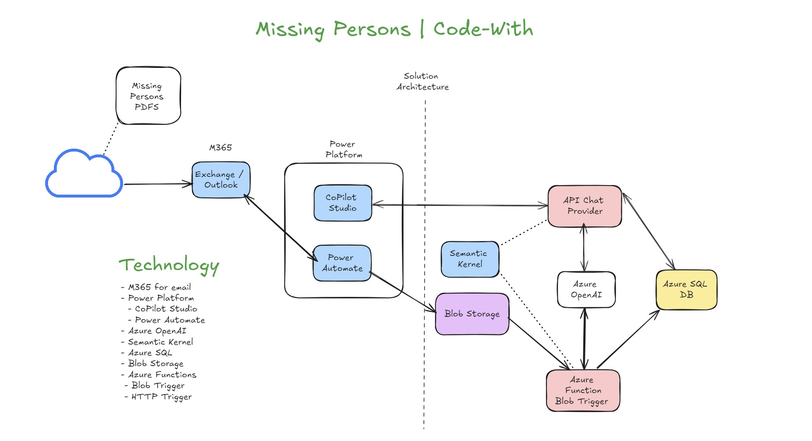
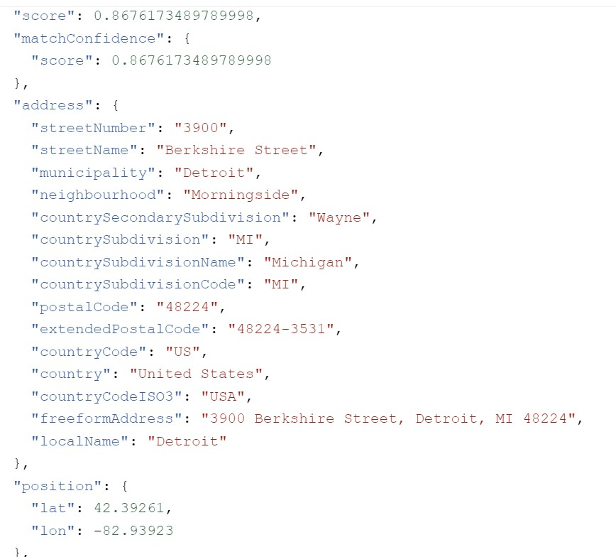

# gen-ai-missing-persons
This solution consists of 2 REST APIs a data ingestion REST API that is triggered when  Missing Person PDF files are uploaded to an Azure Blob Container.  When a PDF is uploaded, the Blob Trigger will parse the contains of the PDF file extracting the Text then it will insert that data into SQL.  The 2nd API is the AI Chat REST service, it allows clients to chat with the data. 

## Solution Architecture
**Important Note** A Power Platform (low-code / Frontend) is not needed for this.  The solution is designed as a set of APIs so it can be consumed by any client i.e. React, Blazor, Streamlit, NextJS, you name it.   

# api-process-missing-persons-pdf
This is the Azure Function (Blob Trigger), which gets fired when a Missing Person PDF file is uploaded to an Azure Storage Account.  The function will extract data from the PDF and insert it into SQL.  This is the only purpose of this API.

# api-missing-persons
This is the GenAI Chat Service that allows any Client to interact with the data in a Chat style manner.  It leverages AI to interact with the data in Natural Language manner.  You are able to ask aggregate style questions about the data, examples below.

   ~~~
      Question: How many people went missing between the months of Oct and Dec?
      Response: A total of 3 people went missing during that timeframe.  
   ~~~

We also have a custom DBQueryPlugin which is used to interact with the DB to collect the data needed to answer the user's question.

## Ideas to consider
The **Missing From** section has the last known location reported missing from.  It does not include a complete address, but this information can be used to get a latitude and longitude using a service like Azure Maps.

## Azure Maps for GeoCoding

[Click here to review the Azure Maps Endpoint geocoding service] (https://learn.microsoft.com/en-us/azure/azure-maps/how-to-search-for-address#request-latitude-and-longitude-for-an-address-geocoding).  Just need to provision an Azure Maps Service, get the client id and key for the service then make a GET request with the address.  Here is an example:

   ~~~
      https://atlas.microsoft.com/search/address/json?subscription-key=<your key>&api-version=1.0&language=en-US&query=3900 block of Berkshire, Detroit
   ~~~

Here is an example of the JSON response you will get back from GET request to Azure Maps Service.

